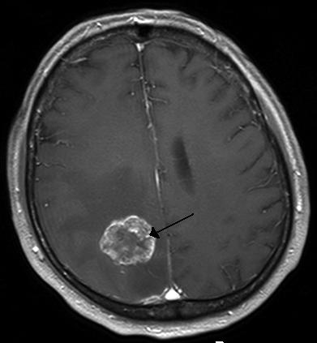

# Introdução e Objetivos

O tumor cerebral é uma das mais agressivas doenças em crianças, jovens e adultos. Os tumores cerebrais representam de 85 a 90% de todos os tumores primários diagnosticados no Sistema Nervoso Central (SNC). Todos os anos, cerca de 11.700 pessoas são diagnosticadas com um tumor no cérebro, a taxa de sobrevida em cinco anos é de aproximadamente 34% para homens e 36% para mulheres. 

Os tumores cerebrais são classificados como: Tumor benigno, Tumor maligno, Tumor hipofisário, etc. A melhor técnica para detectar tumores cerebrais é a ressonância magnética (RM). 

Uma enorme quantidade de dados em imagens são geradas através das digitalizações. Essas imagens são examinadas pelo médico especializado. 

Um exame manual está sujeito a erros humanos no diagnóstico devido ao nível de complexidades envolvidas nos tumores cerebrais e em suas propriedades. Desta forma, a aplicação de técnicas de classificação usando Machine Learning (ML) e Deep Learning (Redes CNN) pode ser adotada e ajudar no diagnóstico. Essa aplicação tem mostrado consistentemente maior precisão do que a classificação manual. 

